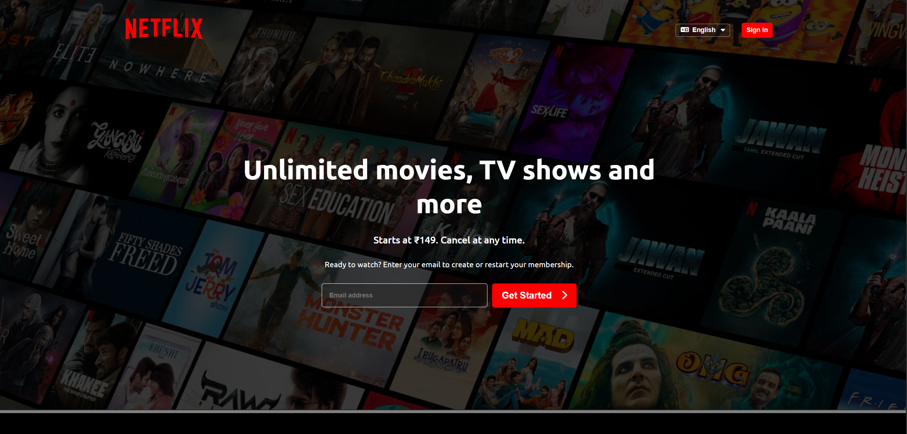
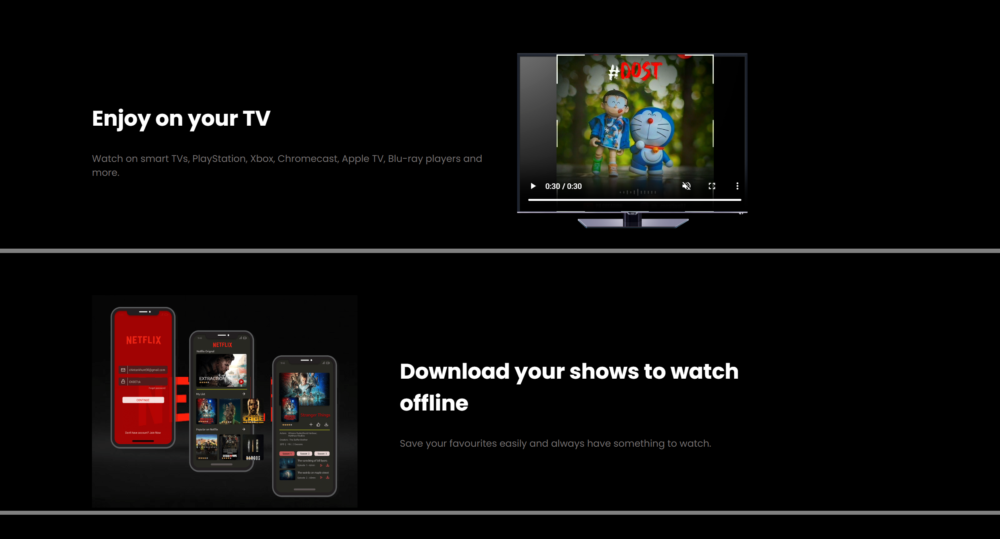
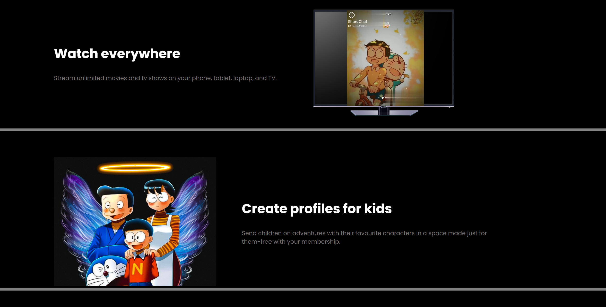
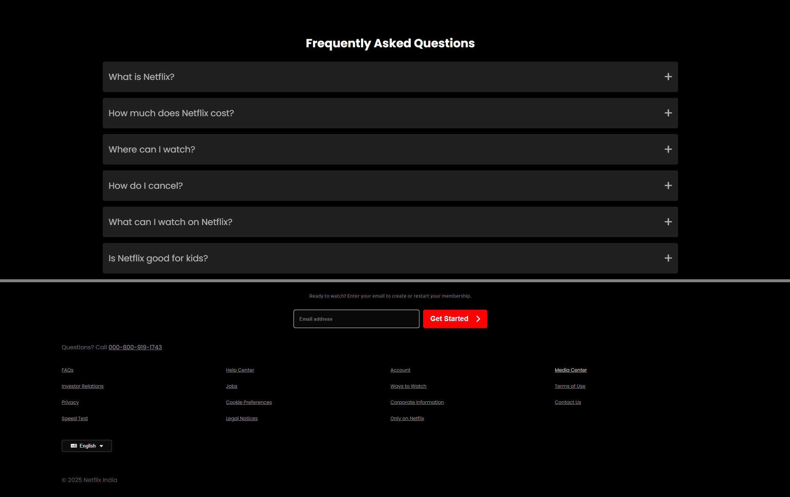
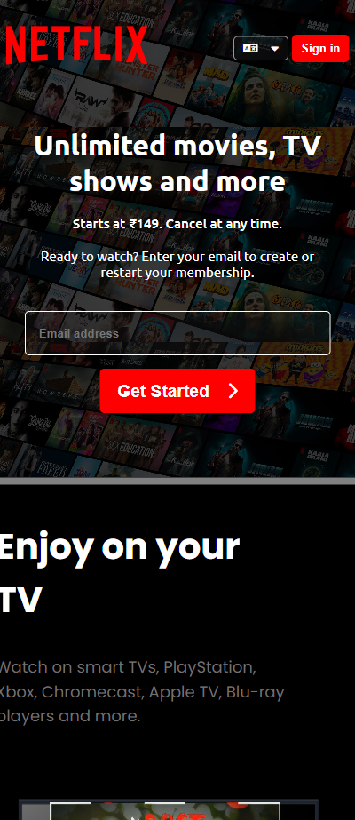
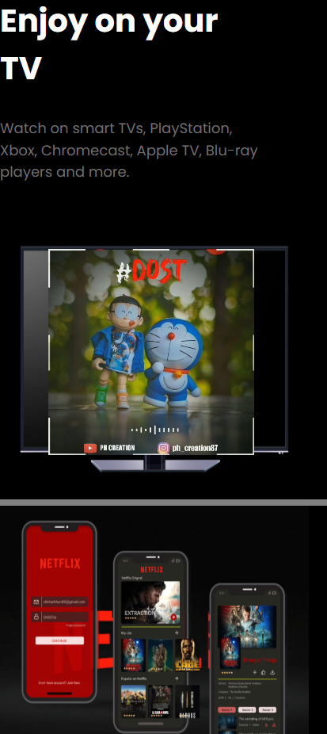
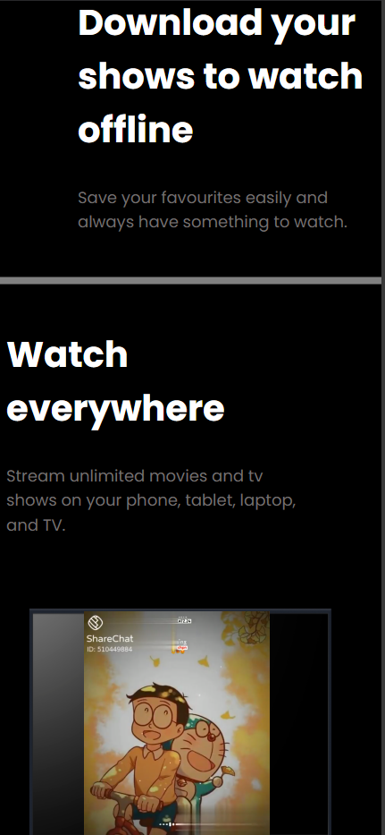
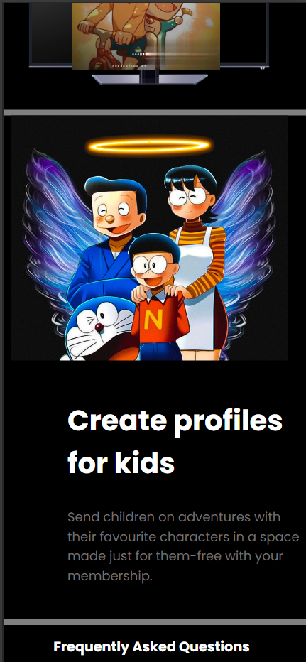
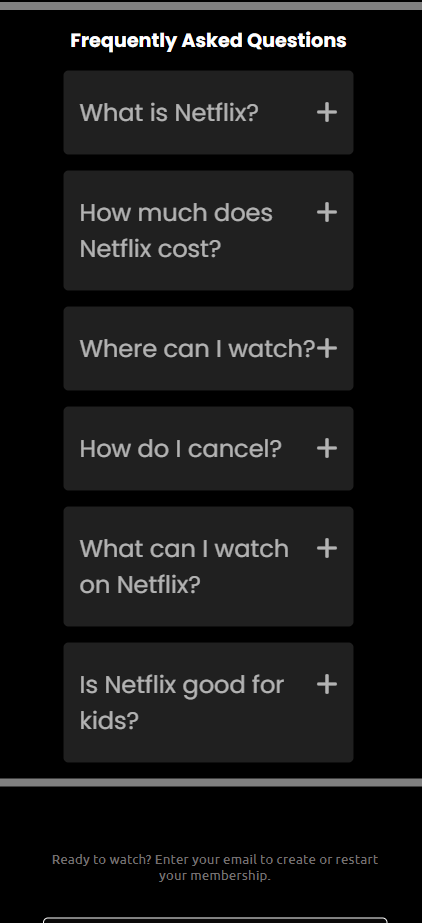
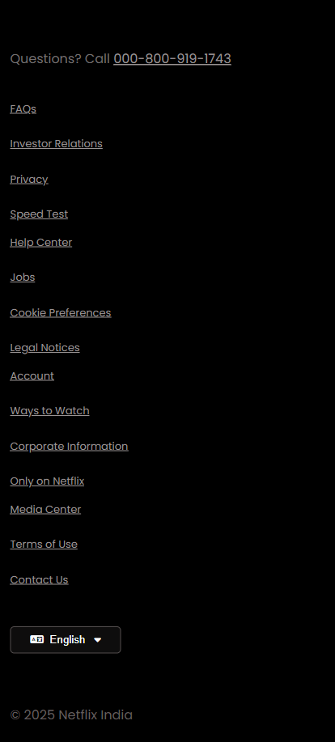

# 🎬 Netflix UI Clone

[](LICENSE)
[](https://codewith-hardik.github.io/netflix-ui/)
[](https://developer.mozilla.org/en-US/docs/Web/HTML)
[](https://developer.mozilla.org/en-US/docs/Web/CSS)

---

## 📄 Description

**Netflix UI Clone** is a responsive front-end project that mimics the official Netflix landing page using only **HTML5** and **CSS3**.  
This project is focused purely on **UI/UX design**, demonstrating clean layout practices, responsive behavior, mobile optimization, and smooth hover animations.

---

## 🔗 Live Preview

👉 **[View Project Live](https://codewith-hardik.github.io/netflix-ui/)**

---

## ✨ Features

- ✅ Fully responsive layout across devices  
- ✅ Clean Netflix-inspired UI  
- ✅ Animated buttons and hover effects  
- ✅ Mobile-friendly navigation  
- ✅ Footer and call-to-action section  
- ✅ Font Awesome social icons  
- ✅ Lightweight and fast performance (pure HTML & CSS)

---

## 🛠 Technologies Used

- HTML5  
- CSS3  
- Font Awesome Icons
- Google Fonts

---

---
## 🌐 Live Demo:  
👉 [View Live Project](https://movie-ui-clone.vercel.app/)
---

---
## 🖼️ Screenshots

### 📱 Homepage


### 🖥️ Responsive View











---

## ⚙️ Installation Instructions

1️⃣ **Clone the Repository**

```bash
git clone https://github.com/codewith-hardik/netflix-ui.git
```

2️⃣ **Navigate to the Project Folder**
```bash
cd netflix-ui
```
3️⃣ **Open index.html in Your Browser**

Just double-click index.html or use a live server if using VS Code.

✅ No build tools, installations, or frameworks required!
